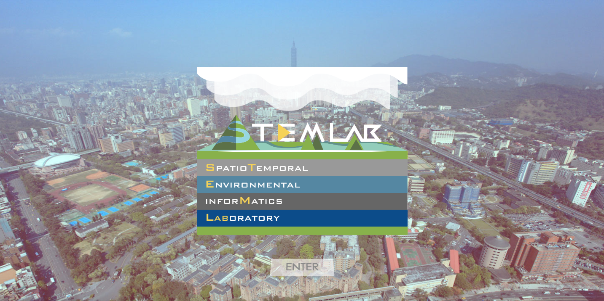
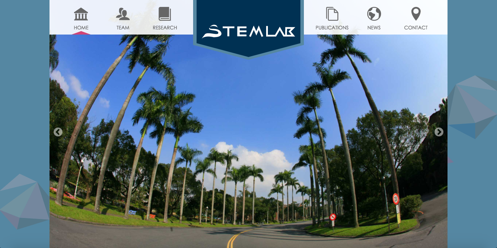

# STEMLab
協助臺灣大學生物環境系統工程學系－時空環境模式研究室，製作研究室官網。

 

 

> ## 網站設計
>此網站採用普魯士藍為主色，營造創新又穩重的配色，包含形象頁的動畫和頁面主框架，使用純CSS手刻而成，採用RWD響應式設計。應用JS做頁面區塊的滑動，讓上方的分類banner能夠確實對應到使用者所在的區塊。並且設計使用者互動效果，包含頁面捲動到某區塊物件再出現以及各式hover效果。

 

